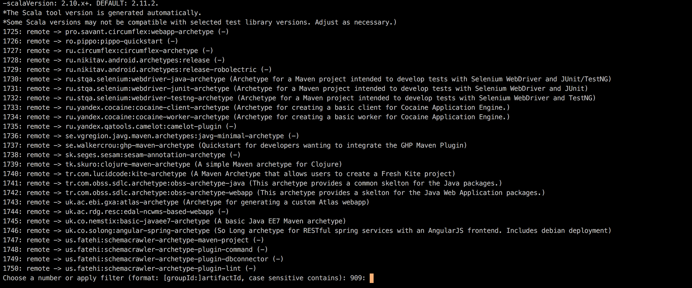
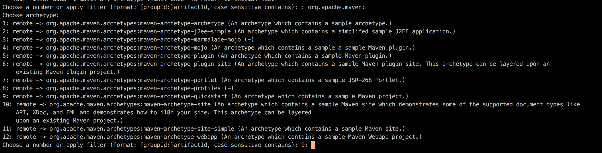

## Maven

### Installing Maven

Follow steps from [project website](https://maven.apache.org/install.html)

### Generating project

Maven goal `mvn archetype:generate` presents you with available project templates. 

```
1724: remote -> pl.org.miki:scala-quickstart-archetype (Customizable cruft-free Scala archetype. Options:
-sourceFolders: [all-in-src-java, scala-only, both-split-src]. DEFAULT: all-in-src-java.
--all-in-src-java: Scala and Java code are both in src/main/java (same for test). Plays nicely with IDEs.
--scala-only: only src/main/scala set up, and set as source folder.
--both-split-src: both src/main/java and src/main/scala. Can play merry havock with IDEs, so not the default.
-testLibrary: [scalatest, specs2, scalacheck-only, junit-only]. DEFAULT: scalatest.
--scalatest: adds Scalatest AND Scalacheck AND JUnit for most of your testing needs.
--specs2: adds specs2 AND Scalacheck AND JUnit.
--scalacheck-junit: adds Scalacheck AND JUnit.
--junit-only: adds JUnit ONLY.
-scalaVersion: 2.10.x+. DEFAULT: 2.11.2.
*The Scala tool version is generated automatically.
*Some Scala versions may not be compatible with selected test library versions. Adjust as necessary.)
1725: remote -> pro.savant.circumflex:webapp-archetype (-)
1726: remote -> ro.pippo:pippo-quickstart (-)
1727: remote -> ru.circumflex:circumflex-archetype (-)
1728: remote -> ru.nikitav.android.archetypes:release (-)
1729: remote -> ru.nikitav.android.archetypes:release-robolectric (-)
1730: remote -> ru.stqa.selenium:webdriver-java-archetype (Archetype for a Maven project intended to develop tests with Selenium WebDriver and JUnit/TestNG)
1731: remote -> ru.stqa.selenium:webdriver-junit-archetype (Archetype for a Maven project intended to develop tests with Selenium WebDriver and JUnit)
1732: remote -> ru.stqa.selenium:webdriver-testng-archetype (Archetype for a Maven project intended to develop tests with Selenium WebDriver and TestNG)
1733: remote -> ru.yandex.cocaine:cocaine-client-archetype (Archetype for creating a basic client for Cocaine Application Engine.)
1734: remote -> ru.yandex.cocaine:cocaine-worker-archetype (Archetype for creating a basic worker for Cocaine Application Engine.)
1735: remote -> ru.yandex.qatools.camelot:camelot-plugin (-)
1736: remote -> se.vgregion.javg.maven.archetypes:javg-minimal-archetype (-)
1737: remote -> se.walkercrou:ghp-maven-archetype (Quickstart for developers wanting to integrate the GHP Maven Plugin)
1738: remote -> sk.seges.sesam:sesam-annotation-archetype (-)
1739: remote -> tk.skuro:clojure-maven-archetype (A simple Maven archetype for Clojure)
1740: remote -> tr.com.lucidcode:kite-archetype (A Maven Archetype that allows users to create a Fresh Kite project)
1741: remote -> tr.com.obss.sdlc.archetype:obss-archetype-java (This archetype provides a common skelton for the Java packages.)
1742: remote -> tr.com.obss.sdlc.archetype:obss-archetype-webapp (This archetype provides a skelton for the Java Web Application packages.)
1743: remote -> uk.ac.ebi.gxa:atlas-archetype (Archetype for generating a custom Atlas webapp)
1744: remote -> uk.ac.rdg.resc:edal-ncwms-based-webapp (-)
1745: remote -> uk.co.nemstix:basic-javaee7-archetype (A basic Java EE7 Maven archetype)
1746: remote -> uk.co.solong:angular-spring-archetype (So Long archetype for RESTful spring services with an AngularJS frontend. Includes debian deployment)
1747: remote -> us.fatehi:schemacrawler-archetype-maven-project (-)
1748: remote -> us.fatehi:schemacrawler-archetype-plugin-command (-)
1749: remote -> us.fatehi:schemacrawler-archetype-plugin-dbconnector (-)
1750: remote -> us.fatehi:schemacrawler-archetype-plugin-lint (-)
Choose a number or apply filter (format: [groupId:]artifactId, case sensitive contains): 909:
```
As there is a lot of them, they can be filtered by passing `[groupId:]artifactId` ie. `org.apache.maven:` will show only archetypes that comes with maven itself. 

Default one is `org.apache.maven.archetypes:maven-archetype-quickstart` a simple java application. It consists of single class App.java, JUnit test AppTest.java and pom.xml.

### pom.xml
POM stands for Project Object Model. It contains information about the project and additional configuration. There can be only one pom.xml per project. Every POM file requires some mandatory fields which are:

* groupId
* artifactId
* version

Those fields should uniquely identify a project. Every POM inherits from so called **Super POM** even if it is not specified. Project pom.xml and Super POM are combined together by Maven to create an *effective POM*.
It can be seen by executing `mvn help:effective-pom` command. 


### Basic goals
 
### Dependecies

### Plugins

#### Configuration
